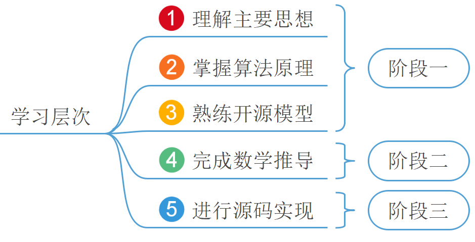
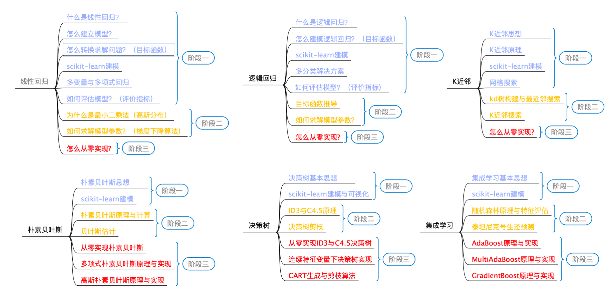

# 从零学AI指南手册

 **公众号/B站/知乎/小红书** ：@跟我学机器学习

# 订阅知识库

大厂算法工程师 | 写作九年累计数百万字

出版《跟我一起学机器学习》|《跟我一起学深度学习》|《一本書晉升深度學習世界級大師》

深谙AI算法入门之道！

扫描 **订阅** 解锁全部内容，两个月轻松入门AI！

 

 

 

# 常见问题

Q1：内容适合初学者学习吗？

完全适合！知识库内容自写作之初就完全是为初学者、跨学科人员所量身打造。作为一个过来人和从业者，我深知大家在学习过程的难点和容易踩的坑，所以在内容的组织结构上、行文逻辑上，都完全是以一个小白的视角在进行叙述。
对于一个机器学习算法的学习过程，我们将它归结成了五个层次（三个阶段）：

其中阶段一可以看成是先从大树主干爬上树顶一窥大树全貌的过程，因为对于一个算法来说，最基本就是它背后的思想，而这也是一个算法的灵魂所在；阶段二和阶段三就可以看成是遍历完整个大树后的层次，是对细枝末节具体的探索。
那为什么会是上面这个排序呢？可以打乱吗？我们的回答是：当然可以，只要是适合自己的方法，那就是好方法。不过掌柜依旧强烈建议按照上述顺序来进行学习。可遗憾的是现在绝大多数人（或资料）的学习顺序都是①②④⑤③或者是①②④③⑤。这两种学习顺序的弊端就在于很多算法在数学推导中是有难度的（例如支持向量机），当克服不了这个难度时很多人就不会接着往下进行了。最后呈现的结果便是，既没有彻底弄清原理，又没有学会如何使用。相反，我们一贯主张的是：先学会怎么用，再探究为什么。

# 读者评论

“这两天搜资料看到您的博客，看完了您的PDF，思路清晰言语通俗详细真的十分震撼，感觉自己读关于BERT的论文的PTSD都被您治好了，而且一开始从博客进入您主页的时候简直不敢相信居然是如此清心静心的客栈，真的好喜欢您的博客！” 
——@麦田云山

“毫不夸张，可以说是我NLP的引路人。来MSRA实习，做的工作和bert/transformer相关，找了很多资料，发现他的最好。不仅是入门，现在也是常读常新。它的文章内容详实，基本上完美解决我所有疑点，并且在github上开源了代码，细节一目了然。这么良心的博主我不允许他默默无闻，他真的是在认真做内容。”
——@李可

“描述得十分生动形象！！对我这种小白来说救了大命了！！博主真的太棒了，把生硬的知识变成通俗易懂的，真的超牛的好吧！！！”
——@xylkgsa

“好厉害！图很清楚！！！感谢大佬！！！真的看英语的纯代码和英语的注释人都要傻了。”
——@十八

“感谢，写得很好，看懂了！之前从来没深入考虑过这些具体实现是怎么做的、为什么。”
——@Scorpio

“您就是我求学生涯中的太阳。”
——@新世纪炼丹道士

“终于遇到会说人话的了，大佬请受我一拜。”
——@凹总宅

“哇塞，发现了一个宝藏级博主，现在研一，没有导师指导，只能盲人摸象。”
——@Ethan

“我为什么没早点看到你这篇文章！写的好详细！”
——@111

“写得非常棒，一直没搞清楚InputChannel是怎么被消除的，看了多通道单卷积核的例子，一下子明白了~”
——@紫吟玉

“搜tensorboard使用的时候看到这篇讲解得非常清晰的好文，于是翻上去看作者是谁，居然是你！你还有多少惊喜是我们这些粉丝不知道的。”
——@我见青山多妩媚

“写的真的太好了，通俗易懂，容易上手，保姆式教程，看过很多博客文章和视频，都不如这篇讲的细，已经把这个PDF刷了N遍了！”
——@小黄人

“写得特别好，特别适合小白来理解注意力机制，看了好多都似懂非懂，作者这篇解释得很好理解，感谢！”
——@小哀2016

“字少但句句精华啊，尤其是最后对比两者对新输入的处理那里，正中我疑惑的要害。对LSTM和GRU有了更深的理解，感谢！！”
——@妙方便面阿

“您真的太牛啦，我最近看您写得那些神经网络的文章，讲得特别清晰易懂，而且注释得超级详细呀，尤其是卷积那块，网上搜罗了一堆，原理都差不多，但就是有几个细节不是很清楚，看了你的文章茅塞顿开，真的是太详细啦~[哇]”
——@深海青鱼

